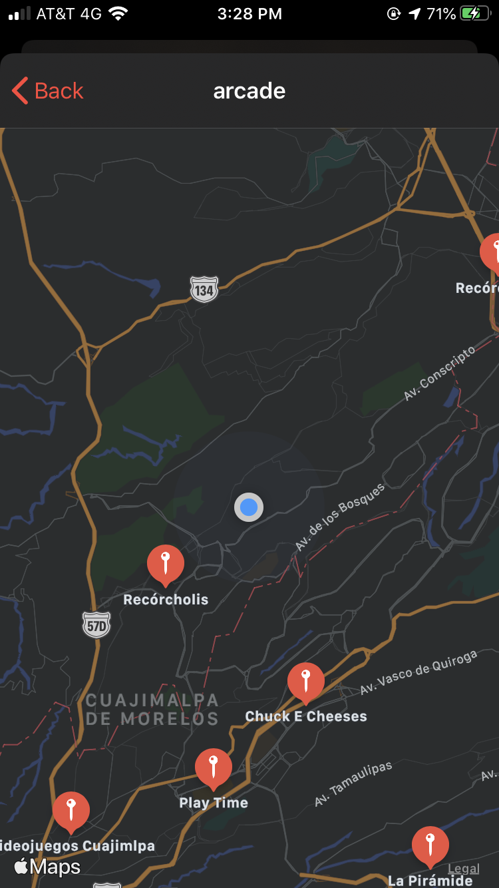
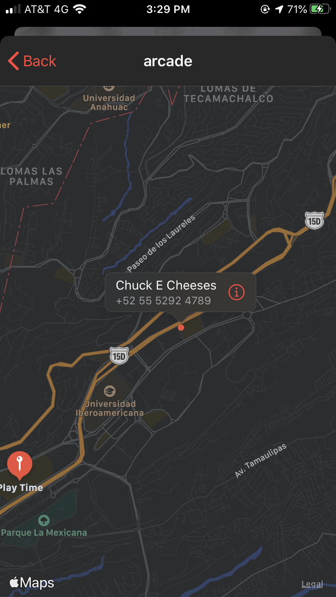
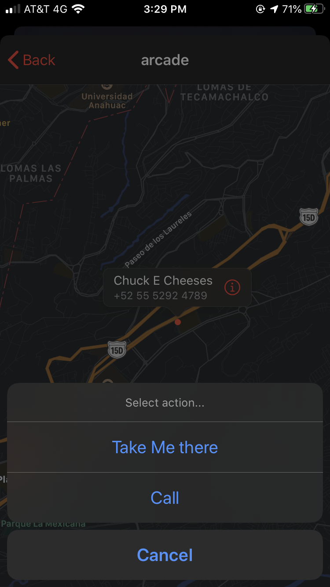
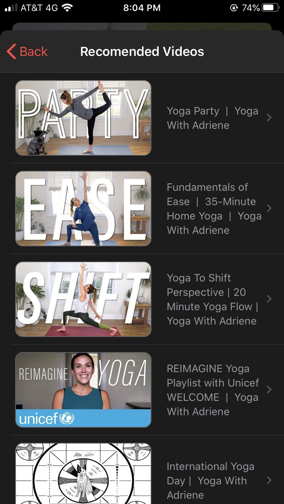
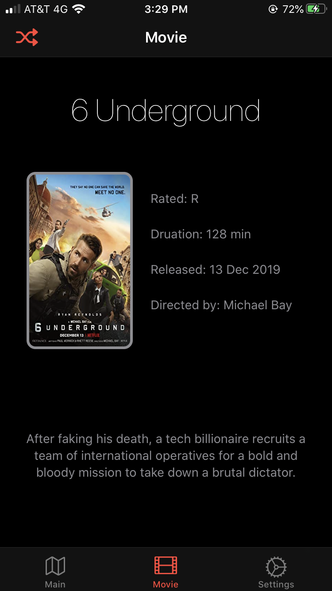
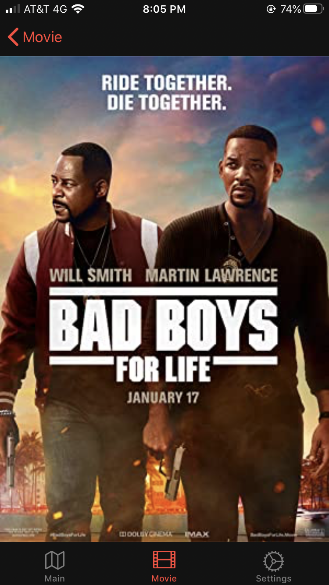
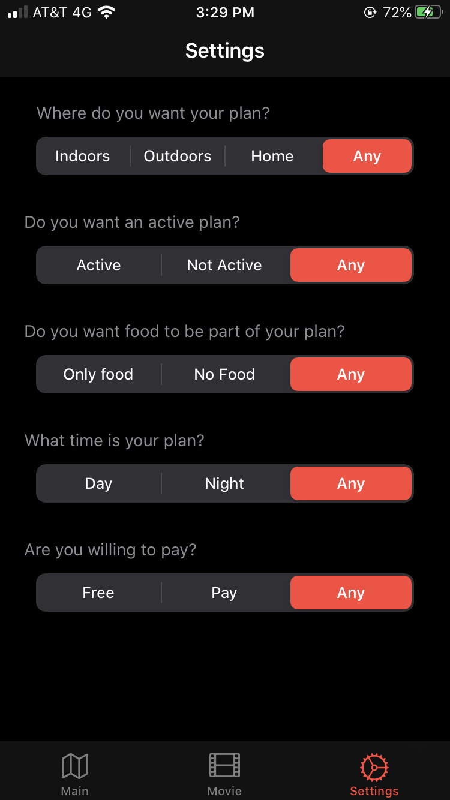

# RandomPlan
iOS app developed in Swift using UIKit framework doing al the UI Programmatically.

* App that will recommend you a random activity to do
* Customize settings to get more specific recommendations.
* Get a random movie recommendation.

## Features
- Get a random activity
- See map with places near you where you can do that activity
- Call the place or get directions
- If the activity is at home you´ll see a list of videos to do the activity instead of a map
- Get a recommendation for a movie
- See the poster of the movie full screen
- Specify parameters for the type of activities you want to do

## Screenshots

### Main Screen

### Activity selected

### Map of places

### Selected Place Pin

### Select to get directions or to call

### List of videos

### Video

### Movie recommendation

### Fullscreen poster

### Settings

